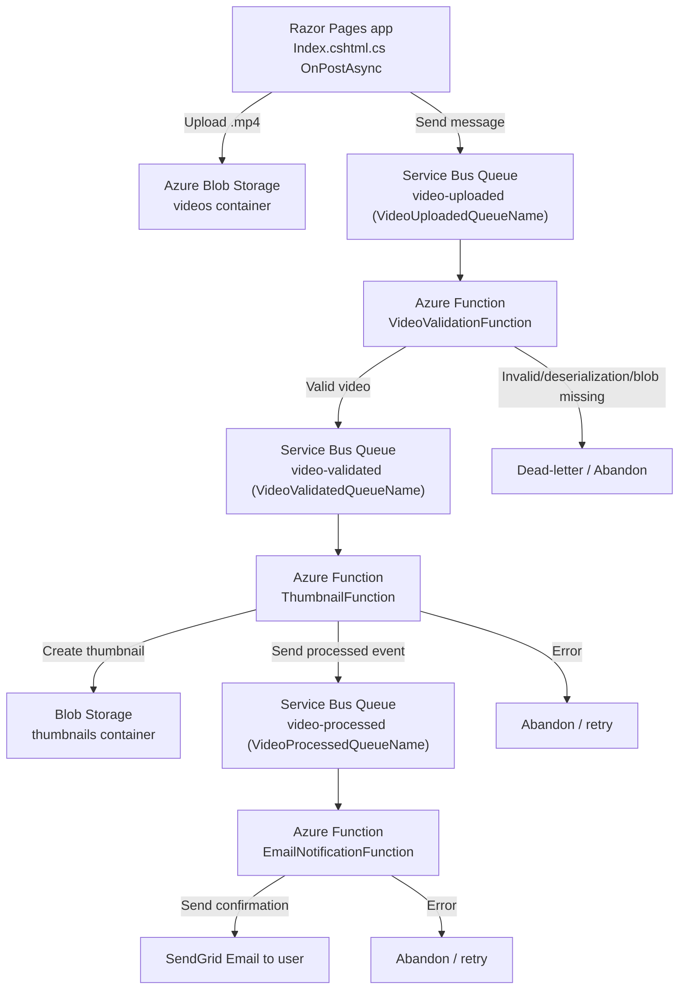

# Video Processing Flow

This document describes how a video moves through the Razor Pages app and Azure Functions pipeline.

## End-to-end Flow Diagram

## Function Chain

`VideoValidationFunction` → `ThumbnailFunction` → `EmailNotificationFunction`

(Connected through `video-validated` and `video-processed` Service Bus queues.)
